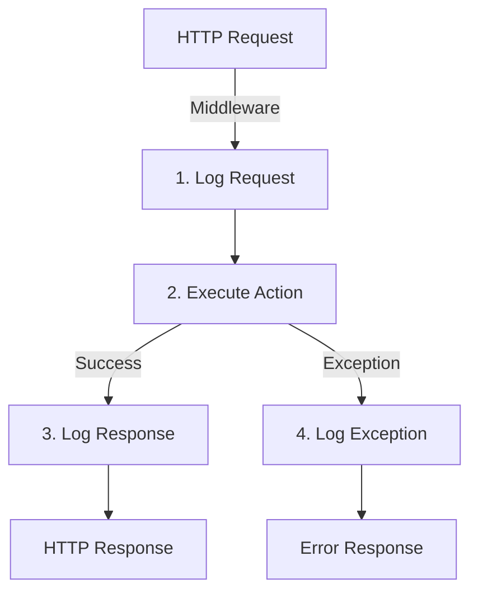

# Logging Guide

## Overview

The NWARE API includes comprehensive logging for all HTTP requests and responses. Logs are saved to files in the `Logs` directory.

## Log Structure

### Request Log
```
[2024-01-15 10:30:45.123] REQUEST
================================================================================
Method: GET
Path: /api/city/GetCities
Headers:
  Host: localhost:5000
  Authorization: ***HIDDEN***
  Content-Type: application/json
Body: (if POST/PUT)
```

### Response Log
```
[2024-01-15 10:30:45.234] RESPONSE
================================================================================
Method: GET
Path: /api/city/GetCities
Status Code: 200
Elapsed Time: 111ms
Response Body: {"code":200,"message":"Success","data":[...],"total":5}
================================================================================
```

### Exception Log
```
[2024-01-15 10:30:45.345] EXCEPTION
================================================================================
Method: GET
Path: /api/city/GetCities
Exception Type: System.InvalidOperationException
Message: An error occurred
StackTrace: ...
Inner Exception: ...
================================================================================
```

## Log Files Location

- **Default**: `{ApplicationRoot}/Logs/`
- **Format**: `api_log_YYYY-MM-DD.log`

### Examples
- `api_log_2024-01-15.log`
- `api_log_2024-01-16.log`
- `api_log_2024-01-17.log`

Each day creates a new log file.

## What Gets Logged

### Request Information
- ? HTTP Method (GET, POST, PUT, DELETE, etc.)
- ? URL Path & Query String
- ? All HTTP Headers (sensitive headers hidden)
- ? Request Body (if present)

### Response Information
- ? HTTP Status Code
- ? Response Body
- ? Execution Time (elapsed milliseconds)

### Exception Information
- ? Exception Type
- ? Error Message
- ? Stack Trace
- ? Inner Exceptions

## Security

### Sensitive Data Protection
- ? **Authorization header** ? Shown as `***HIDDEN***`
- ? **API Keys** ? Not logged in full
- ? **Passwords** ? Never logged
- ? **Tokens** ? Masked

## Usage

### View Logs in Real-time
```bash
# Windows PowerShell
Get-Content -Path "Logs/api_log_2024-01-15.log" -Wait

# Linux/Mac
tail -f Logs/api_log_2024-01-15.log
```

### Search Logs
```bash
# Find all failed requests (4xx, 5xx)
Select-String "Status Code: 4" Logs/api_log_*.log
Select-String "Status Code: 5" Logs/api_log_*.log

# Find specific user requests
Select-String "GET /api/city" Logs/api_log_*.log

# Find exceptions
Select-String "EXCEPTION" Logs/api_log_*.log
```

### Parse Logs
```csharp
// Example: Parse log file in C#
var logContent = File.ReadAllText("Logs/api_log_2024-01-15.log");
var requests = Regex.Matches(logContent, @"\[.*?\]\s+REQUEST");
```

## Middleware Flow



## Performance Impact

- **Request Logging**: ~1-2ms
- **Response Logging**: ~1-2ms
- **File I/O**: Minimal (async operations)

Total overhead per request: ~2-5ms

## Configuration

### Current Settings
- **Service**: `FileLoggingService`
- **Storage**: File system in `Logs` directory
- **Frequency**: Every request/response
- **Retention**: Manual cleanup required

### Future Enhancements
- [ ] Log rotation based on file size
- [ ] Database logging option
- [ ] Remote logging (ELK Stack, Splunk)
- [ ] Structured logging (JSON format)
- [ ] Log level filtering
- [ ] Real-time log dashboard

## Example Log Output

```
================================================================================
[2024-01-15 10:30:45.123] REQUEST
================================================================================
Method: GET
Path: /api/city/GetCities
Headers:
  Host: localhost:5000
  User-Agent: Mozilla/5.0
  Authorization: ***HIDDEN***
  Accept: application/json
Body: 

================================================================================
[2024-01-15 10:30:45.234] RESPONSE
================================================================================
Method: GET
Path: /api/city/GetCities
Status Code: 200
Elapsed Time: 111ms
Response Body: {"code":200,"message":"Success","data":[{"City Name":"Bangkok","Country":"Thailand","Population":5104476}],"total":1}
================================================================================

```

## Troubleshooting

### Logs Not Being Created
- ? Check `Logs` directory exists
- ? Verify file permissions (write access)
- ? Check application has access to directory

### Logs Not Recording Requests
- ? Verify middleware is registered in `Startup.cs`
- ? Middleware must be added **before** routing
- ? Check if endpoints are being called

### File Lock Issues
- ? Multiple instances can write to same log file
- ? File locking is handled by OS
- ? Ensure antivirus doesn't lock log files

## Best Practices

1. **Regular Review**
   - Review logs daily in development
   - Monitor for errors/exceptions

2. **Archive Old Logs**
   - Keep last 7 days in active `Logs` directory
   - Archive older logs separately

3. **Storage Management**
   - Monitor disk space usage
   - Implement cleanup policy

4. **Analysis**
   - Use log analysis tools
   - Track common errors
   - Monitor performance trends

5. **Privacy**
   - Don't log sensitive user data
   - Keep confidential information masked
   - Follow data protection regulations (GDPR, etc.)
